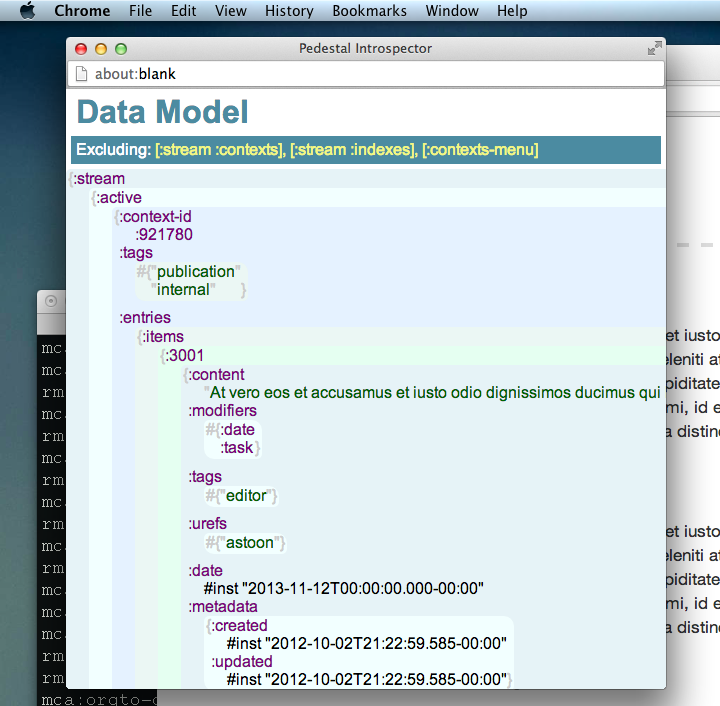

# pedestal-introspector

This library provides tool for visualization application state while
developing ClojureScript-based projects with
[Pedestal](http://pedestal.io). In browser, press `Ctrl+I`
and see current information model in popup window:



## Current state

Currently, it visualizes:

 1. Data model

## Installation

Leiningen coordinates:

```clojure
[ilshad/pedestal-introspector "0.2.0-SNAPSHOT"]
```

## Usage

**Step One:** Create introspector with app in `start.cljs`:

```clojure
(ns myapp.start
  (:require ...
            [ilshad.pedestal-introspector :as introspector]
			...))

(defn ^:export main []
  (let [app (create-app (render-core/render-config))]
    (introspector/create app)))
```

**Step Two:** Enable keyboard shortcut somewhere in rendering code.
For example:

```clojure
(ns myapp.rendering
  (:require ...
            [ilshad.pedestal-introspector :as introspector]
			...))

(defn render-main [_ _ _]
  ...
  (introspector/bind-key)
  ...
  )

(defn render-config []
  [[:node-create [:main] render-main]
  ...
  ])
```

By default, keybinding is `Ctrl+I`. Press it in browser while working
with Development Aspect and see curent information model.

## Options

_(added in 0.2.0)_ Big trees are rendering too slow in the introspector's
window. It can be annoying. Use keyword argument `exclude` with vector
of vectors - paths in the data model:

```clojure
(defn ^:export main []
  (let [app (create-app (render-core/render-config))]
    (introspector/create app :exclude [[:stream :contexts]
                                       [:stream :indexes]
                                       [:contexts-menu]])
```

## Other ways to open popup

Instead of keyboard shortcut, you can call popup window manually. Type
in JavaScript console:

    ilshad.pedestal_introspector.open()

Or call `(ilshad.pedestal-introspector/open)` somewhere in ClojureScript.

## Known issues

There are CSS trubles in Firefox. Google Chrome is only supported currently.

## License

Copyright © 2013 [Ilshad Khabibullin](http://ilshad.com).

Distributed under the Eclipse Public License either version 1.0 or (at
your option) any later version.
